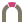

# CloudNativePatroni

<p>
  
</p>

A Kubernetes operator for Postgres in which upstream Patroni is the sole
high-availability authority. CloudNativePatroni is derived from CloudNativePG
and keeps its operator surface, while delegating Postgres process lifecycle,
leader election, promotion, demotion, replication topology, and former-primary
recovery to Patroni.

> CloudNativePatroni is an independent project derived from CloudNativePG. It is not affiliated
> with or endorsed by CloudNativePG, CNCF, LF Projects, or the Patroni maintainers.

## Project status

**Pre-alpha architecture spike. Not production software. Not usable today.**

- Nothing works yet. The fork is at milestone M0, whose deliverables are fork
  hygiene, an audit of the inherited high-availability code paths, and an
  accepted architecture decision record for the Pod process model. No
  Patroni-managed cluster can be created from this repository at this time.
- There are no releases, no published images, no installation instructions, and
  no upgrade path. Do not deploy this.
- The architecture described below is a target, not an implementation. The
  process model in particular is subject to ADR-002, which is **proposed and not
  yet accepted**.
- Out of scope for the spike, per specification section 5.3: converting an
  existing cluster in place; backup, point-in-time recovery, scheduled backups,
  volume snapshots, and CNPG-I plugins; major Postgres upgrades; cross-region
  and standby clusters; synchronous replication; the Pooler, Database,
  DatabaseRole, Publication, and Subscription resources; alternative
  distributed configuration stores; a Patroni fork; and any support or
  service-level commitment.
- Milestones, per specification section 16: **M0** fork hygiene, authority
  audit, and the process ADR; **M1** a Patroni-owned three-node cluster; **M2**
  container lifecycle, probes, and routing; **M3** the chaos safety gate; **M4**
  alpha ergonomics, which begins only after M3 is accepted. Only M0 is in
  progress.

## Why this project exists

### Three failover classes

Postgres failover has three distinct failure classes. The full
[failure taxonomy](docs/cnpatroni/failure-modes.md) defines their mechanisms and
limits.

1. **Data loss at failover.** With asynchronous replication, an acknowledged
   transaction whose write-ahead log the promoted standby never received may be
   lost. Patroni documents the bound as `maximum_lag_on_failover` bytes plus
   whatever is written during the last lease interval. It is an accepted
   durability trade, not a correctness failure; synchronous replication is the
   separate design that addresses this class.
2. **Sequential timeline fork.** The old primary stops before the new primary
   accepts writes. Postgres starts a new timeline, and `pg_rewind` later returns
   the former primary to the last checkpoint the two shared, from which it
   replays the new timeline. What rewind drops is the old timeline's orphaned
   tail, whose acknowledged part was already lost under the first class.
3. **Concurrent timeline fork (split brain).** Two nodes accept writes beyond
   the divergence point at the same time. Both histories contain acknowledged
   commits, they cannot be merged, and choosing either one discards unbounded
   work from the other.

Preventing the third class requires that write authority be removed from the old
node before a replacement starts — either the node loses the ability to
acknowledge a commit on its own, or something outside it fences the node. It
does not prevent the first class, and preventing the first class does not
prevent the third. CloudNativePatroni does not yet claim that the third class is
prevented: the direct-Pod write oracle has not run against a live cluster, and
the eventual guarantee will be limited to a supported fault model.

### Why Patroni under an operator

Patroni under a Kubernetes operator is a proven model used by Crunchy Data PGO,
StackGres, and Zalando's postgres-operator. CloudNativePatroni keeps the
CloudNativePG operator surface — its declarative API, resource and lifecycle
machinery, and ecosystem — while replacing the inherited self-implemented
high-availability layer with upstream Patroni.

The objective is to stop reimplementing Postgres high availability. Patroni
carries many years of accumulated production behaviour around leader-lock
renewal, failsafe mode, candidate eligibility, timeline validation,
`pg_rewind`, crash recovery, replication slots, synchronous modes, and
maintenance. Those behaviours would otherwise have to be built and maintained
in this project.

### The counter-argument, stated honestly

Crunchy Data PGO, StackGres, and Zalando's postgres-operator already provide
this model. For anyone who does not specifically need CloudNativePG's API,
resource model, and ecosystem, adopting one of them is cheaper. This project is
for the narrower case where keeping that operator surface matters.

### Why this is a fork

Adopting Patroni adds a Python runtime to the database image and replaces the
inherited high-availability subsystem. Maintaining that change as a fork keeps
the integration boundary explicit.

## Architecture summary

### The single-authority rule

Specification section 4.1 is normative and is quoted here verbatim. At all times
there is exactly one component with authority to decide whether PostgreSQL may
be writable: **Patroni**.

```text
For every instance and every time t:

PostgreSQL may be primary and accept writes
only if local Patroni considers itself primary
and holds valid write authority under Patroni's DCS rules.
```

The operator, the integration agent, kubelet, the container runtime, and any
optional minimal init may observe state or remove availability by terminating a
process or container. They must not grant write authority, promote Postgres, or
restart Postgres independently of Patroni.

### Process and container model

The target Pod layout, compressed from specification section 7.1:

```text
Kubernetes Pod
|
+-- config-init (optional, finite)
|
+-- patroni container (main database container)
|   |
|   +-- minimal init (optional; signal forwarding and reaping only)
|       |
|       +-- Patroni (container lifecycle root)
|           |
|           +-- PostgreSQL postmaster
|
+-- cnpatroni-agent container (sidecar; no HA or process authority)
```

The numeric PID is not the invariant. Patroni may be PID 1, or the direct child
of a transparent init such as `tini`. The invariant is that no long-lived
wrapper may remain healthy after Patroni exits and thereby leave the database
container or Postgres running. Patroni and Postgres run in the same container
and cgroup; the integration agent is a separate container so that its failure or
restart cannot keep an unsupervised Postgres process alive.

**This model is subject to ADR-002, which is proposed and not yet accepted.**
The alternative under evaluation retains a CloudNativePG-derived supervisor as
PID 1. Specification section 21 states the decision drivers, the required
experiment, and the acceptance criteria; the ADR must be accepted during M0.

### Who owns what

Compressed from the authority matrix in specification section 7.3:

| Area | Sole owner |
|---|---|
| Pod, PVC, Service, Secret, and RBAC lifecycle | Operator |
| Scheduling, resources, security context | Operator |
| Postgres process lifecycle | Patroni |
| Primary election and the leader lock | Patroni |
| Promotion and demotion | Patroni |
| Replication topology, slots, `pg_rewind`, reinitialization | Patroni |
| Dynamic high-availability configuration | Patroni |
| Write routing | Patroni-managed Endpoints (`kubernetes.use_endpoints: true`) behind a selectorless Service; not a write-safety boundary — it steers new connections, not open ones or direct Pod access |
| Read routing | Patroni-derived Pod labels; not a write-safety boundary |
| Cluster status | Operator, as an observer; informational, never authoritative |
| Container restart and hang detection | kubelet and the container runtime |
| Hard local fencing | Patroni watchdog or an external fence, in a future strict mode |

The operator may request a switchover; it never implements one. The distributed
configuration store, not any field in the resource status, is the source of
write authority.

## Relationship to the upstream projects

### CloudNativePG

This repository is a fork of [CloudNativePG](https://github.com/cloudnative-pg/cloudnative-pg)
taken at commit `b226821` (2026-08-06), which is post-1.30.0 development on the
upstream `main` branch. The version constant in the inherited code still reads
`1.30.0` because upstream raises it at the next release; the derivation point is
the commit. Specification section 20.1 asks for the `v1.30.0` tag as the fork
base, so this is a recorded deviation, described in [`CLAUDE.md`](CLAUDE.md)
under rule 4 and open with the project owner.

The inherited code is licensed under Apache-2.0, and the inherited documentation
under CC BY 4.0. Both licences are preserved: [`LICENSE`](LICENSE) covers the
repository, [`docs/LICENSE`](docs/LICENSE) covers `docs/`, and
[`licenses/`](licenses/) carries third-party dependency licences. Copyright
notices in inherited files are retained unchanged, as Apache-2.0 requires for
derivative work. [`NOTICE`](NOTICE) records the derivation, the fact that files
have been modified, and the attribution obligation that CC BY 4.0 places on any
documentation page this project adapts. No page under `docs/` has been adapted
yet, so no per-page credit line exists yet either.

The merge policy is continuous upstream tracking rather than a single merge.
Specification section 20 defines the repository model, the merge policy, and the
dependency policy; the in-repository documentation for that process is collected
under [`docs/cnpatroni/`](docs/cnpatroni/) as it lands.

CloudNativePatroni does not use the CloudNativePG name, logo, or visual identity
as its own branding. It names the project only to describe derivation.

### Patroni

[Patroni](https://github.com/patroni/patroni) is licensed under the MIT licence.
It is not packaged in this repository yet. When the database image is built,
Patroni is packaged as an unmodified, pinned upstream release, with dependencies
pinned by version and hash, and its licence text and attribution ship with that
image. Behavioural patches to Patroni are not permitted: integration code
belongs in this repository, and any required change is proposed upstream first.

### The other Patroni-based operators

Crunchy Data PGO, StackGres, and Zalando postgres-operator are named in this
README because they establish the model this project adopts. StackGres is also
cited in the specification as a production precedent for the container process
model. None of these projects is affiliated with CloudNativePatroni, and nothing
here implies their endorsement.

## Who this is for

**Right now, this repository is for engineers implementing and reviewing the
fork.** It is useful if you are working through the authority audit, ADR-002,
the identifier policy, or the upstream integration process, and you need the
architecture and its constraints in one place.

**It is not for anyone who wants to run Postgres.** If you need a Postgres
operator today, use one that is released. This repository has nothing to
install.

## Repository orientation

- [`docs/cnpatroni/`](docs/cnpatroni/) — documentation owned by this fork,
  including the [identifier and naming policy](docs/cnpatroni/naming-policy.md).
- [`docs/cnpatroni/brand/`](docs/cnpatroni/brand/) — the mark, the colour and type tokens, and the
  brand guideline, including the evidence for the project's visual independence.
- [`CLAUDE.md`](CLAUDE.md) — the working rules for this repository, including
  the single-authority rule and the constraint that no broad identifier rename
  happens yet.
- [`CONTRIBUTING.md`](CONTRIBUTING.md), [`GOVERNANCE.md`](GOVERNANCE.md),
  [`MAINTAINERS.md`](MAINTAINERS.md), [`SECURITY.md`](SECURITY.md),
  [`SUPPORT.md`](SUPPORT.md), [`CODE_OF_CONDUCT.md`](CODE_OF_CONDUCT.md),
  [`ROADMAP.md`](ROADMAP.md), [`DEPENDENCIES.md`](DEPENDENCIES.md) — this
  project's own statements, not CloudNativePG's.
- `api/`, `internal/`, `pkg/`, `config/`, `tests/` — inherited CloudNativePG
  code, unchanged at M0.
- [`contribute/`](contribute/) — inherited developer documentation. The build
  and test mechanics in
  [`contribute/development_environment`](contribute/development_environment) and
  [`contribute/e2e_testing_environment`](contribute/e2e_testing_environment) are
  still accurate. The community, governance, roadmap, and chat-channel content
  in [`contribute/README.md`](contribute/README.md) is CloudNativePG's and does
  not apply to this fork; it has not been rewritten yet.

## Licence

Apache-2.0 for code, CC BY 4.0 for the documentation under `docs/`. See
[`LICENSE`](LICENSE), [`docs/LICENSE`](docs/LICENSE), and [`NOTICE`](NOTICE).

---

<p align="center">
<a href="https://www.postgresql.org/about/policies/trademarks/">Postgres, PostgreSQL, and the Slonik Logo</a>
are trademarks or registered trademarks of the PostgreSQL Community Association
of Canada, and used with their permission.
</p>

---

> CloudNativePatroni is an independent project derived from CloudNativePG. It is not affiliated
> with or endorsed by CloudNativePG, CNCF, LF Projects, or the Patroni maintainers.
